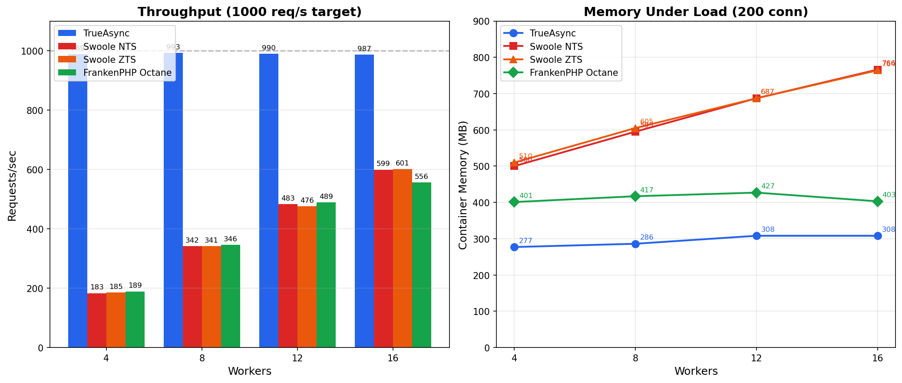
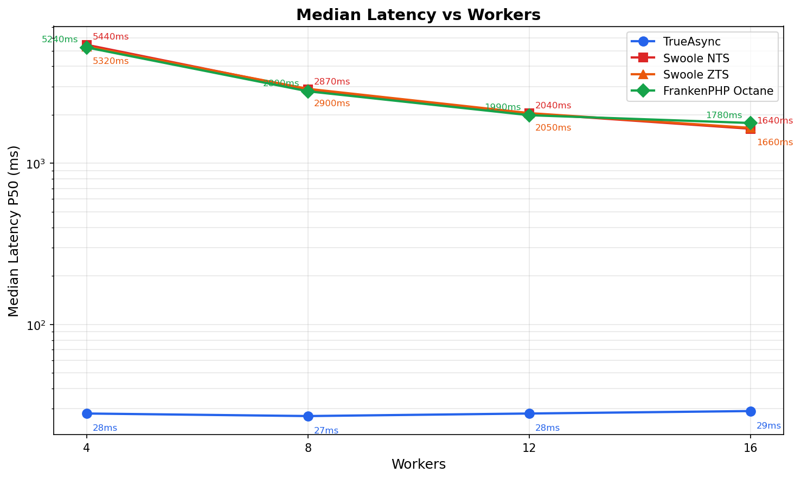
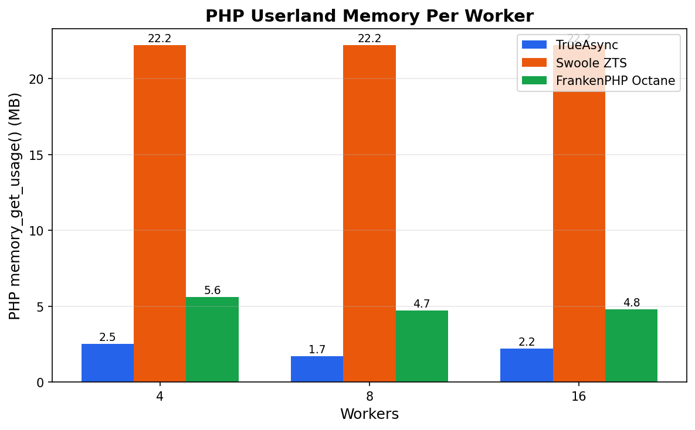

# Benchmark: TrueAsync vs Octane Swoole vs Octane FrankenPHP

**Date:** 2026-04-03  
**Load:** 1000 req/s (constant arrival rate), 30 seconds, up to 1000 VUs  
**Tool:** k6 (`constant-arrival-rate`, 1000 iter/s)  
**Endpoint:** `/bench` — 10 SQL queries per request (PostgreSQL)

---

## Environment

| Parameter | Value |
|-----------|-------|
| **Host OS** | WSL2 (Linux 5.15.146.1-microsoft-standard-WSL2) |
| **CPU** | 16 cores |
| **RAM** | 7.8 GB |
| **Docker** | 29.2.0 |
| **Database** | PostgreSQL 16 Alpine (per-service, `max_connections=500`) |

---

## Configuration

| | TrueAsync FrankenPHP | Octane Swoole (NTS) | Octane Swoole (ZTS) | Octane FrankenPHP |
|---|---|---|---|---|
| **PHP** | 8.6.0-dev (ZTS) | 8.5.4 (NTS) | 8.5.4 (ZTS) | 8.5.4 (NTS) |
| **Server** | FrankenPHP v2.11.2 (true-async fork) | Swoole 6.2.0 | Swoole 6.2.0 | FrankenPHP (official) |
| **Laravel** | 13.2.0 | 13.2.0 | 13.2.0 | 13.2.0 |
| **OPcache** | validate_timestamps=0, 128MB | validate_timestamps=0, 128MB | validate_timestamps=0, 128MB | default |
| **Worker model** | Coroutines (libuv, buffer=50) | Processes (fork) | Threads (ZTS) | Processes (fork) |
| **Port** | 8083 | 8084 | 8084 | 8085 |

---

## Workload: `/bench`

Each request executes **10 SQL queries** against PostgreSQL:

| # | Type | Query |
|---|------|-------|
| 1 | SELECT | User by ID (auth lookup) |
| 2 | SELECT | 10 posts by user (list) |
| 3 | INSERT | post_view record |
| 4 | UPDATE | post views_count +1 |
| 5 | SELECT | Aggregate — total views + last view |
| 6 | SELECT | Top 5 most viewed posts |
| 7 | SELECT | Post count per user, top 5 |
| 8 | SELECT | Another user profile |
| 9 | SELECT | 5 posts by the other user |
| 10 | SELECT | 10 most recent post_views |

**Database:** 100 users, 1000 posts, growing post_views table. Fresh seed before each test.

---

## Charts

### Throughput & Container Memory

### Median Latency (log scale)

### PHP Userland Memory Per Worker

---

## Results: Throughput (req/s)

| Workers | TrueAsync | Swoole NTS | Swoole ZTS | FrankenPHP Octane |
|---------|-----------|------------|------------|-------------------|
| **4** | **989** | 183 | 185 | 189 |
| **8** | **993** | 342 | 341 | 346 |
| **12** | **990** | 483 | 476 | 489 |
| **16** | **987** | 599 | 601 | 556 |

---

## Results: Median Latency (P50)

| Workers | TrueAsync | Swoole NTS | Swoole ZTS | FrankenPHP Octane |
|---------|-----------|------------|------------|-------------------|
| **4** | **28 ms** | 5,440 ms | 5,320 ms | 5,240 ms |
| **8** | **27 ms** | 2,870 ms | 2,900 ms | 2,800 ms |
| **12** | **28 ms** | 2,040 ms | 2,050 ms | 1,990 ms |
| **16** | **29 ms** | 1,640 ms | 1,660 ms | 1,780 ms |

---

## Results: P95 Latency

| Workers | TrueAsync | Swoole NTS | Swoole ZTS | FrankenPHP Octane |
|---------|-----------|------------|------------|-------------------|
| **4** | **60 ms** | 5,630 ms | 5,520 ms | 5,390 ms |
| **8** | **70 ms** | 3,110 ms | 2,990 ms | 3,190 ms |
| **12** | **76 ms** | 2,240 ms | 2,220 ms | 2,160 ms |
| **16** | **79 ms** | 1,900 ms | 1,790 ms | 1,910 ms |

---

## Results: Dropped Iterations (% of target not met)

| Workers | TrueAsync | Swoole NTS | Swoole ZTS | FrankenPHP Octane |
|---------|-----------|------------|------------|-------------------|
| **4** | 0.5% | 78% | 78% | 78% |
| **8** | 0.4% | 63% | 63% | 62% |
| **12** | 0.8% | 48% | 49% | 48% |
| **16** | 1.1% | 36% | 36% | 41% |

---

## Results: Memory Usage

### Idle

| Workers | TrueAsync | Swoole NTS | Swoole ZTS | FrankenPHP Octane |
|---------|-----------|------------|------------|-------------------|
| **4** | **147 MB** | 481 MB | 512 MB | 357 MB |
| **8** | **248 MB** | 555 MB | 604 MB | 366 MB |
| **12** | **271 MB** | 633 MB | 687 MB | 388 MB |
| **16** | **326 MB** | 762 MB | 765 MB | 421 MB |

### Under Load (200 concurrent connections)

| Workers | TrueAsync | Swoole NTS | Swoole ZTS | FrankenPHP Octane |
|---------|-----------|------------|------------|-------------------|
| **4** | **206 MB** | 500 MB | 510 MB | 386 MB |
| **8** | **320 MB** | 595 MB | 605 MB | 425 MB |
| **12** | **327 MB** | 687 MB | 687 MB | 427 MB |
| **16** | **344 MB** | 766 MB | 764 MB | 370 MB |

### Memory per Additional Worker (idle, approximate)

| | TrueAsync | Swoole NTS | Swoole ZTS | FrankenPHP Octane |
|---|-----------|------------|------------|-------------------|
| **MB/worker** | ~15 | ~23 | ~21 | ~5 |

---

## Analysis

### 1. TrueAsync saturates the target regardless of worker count

TrueAsync holds **~990 req/s** (the k6 ceiling) with 4, 8, 12, or 16 workers. Median latency is stable at **~28 ms**. Adding workers provides no benefit because the bottleneck is PostgreSQL throughput, not PHP concurrency.

With `buffer=50`, each worker runs up to 50 coroutines concurrently. At 4 workers that's **200 effective connections** — more than enough to keep PostgreSQL saturated. The coroutine yields during every `PDO::query()` call, allowing other coroutines to run while waiting for the database response.

### 2. Swoole ZTS (threads) ≈ Swoole NTS (processes)

| Workers | NTS req/s | ZTS req/s | NTS mem | ZTS mem |
|---------|-----------|-----------|---------|---------|
| 4 | 183 | 185 | 481 MB | 512 MB |
| 8 | 342 | 341 | 555 MB | 604 MB |
| 12 | 483 | 476 | 633 MB | 687 MB |
| 16 | 599 | 601 | 762 MB | 765 MB |

**Threads give zero throughput improvement over processes.**

This is expected because Swoole's thread mode (6.2) still runs each worker as a **blocking event loop**. Switching from `fork()` to `pthread_create()` changes the isolation boundary but not the concurrency model. Each worker — whether a process or a thread — still executes one request at a time, blocking on every SQL query.

**Why ZTS uses slightly more memory (+5-10%):**

- The ZTS (Zend Thread Safety) allocator wraps every global in a thread-local storage (TLS) lookup via `TSRMLS` macros. This adds per-thread overhead to every Zend engine structure.
- Thread stacks are allocated from the same address space (no copy-on-write benefit that `fork()` gets from shared read-only pages like the OPcache SHM segment).
- Swoole's thread runtime allocates additional synchronization structures (mutexes, thread-local arena pools) that the process model doesn't need.

**Why threads don't help throughput:**

The bottleneck is not process creation overhead or context switching — it's **I/O wait**. Each worker spends ~95% of its time blocked in `PDO::query()` → `poll()`/`epoll_wait()` waiting for PostgreSQL. Threads and processes block identically on a file descriptor. The kernel scheduler treats both the same way. The only way to reclaim that idle time is to yield to another coroutine (what TrueAsync does) or to add more workers.

### 3. Octane FrankenPHP ≈ Octane Swoole

FrankenPHP via Octane and Swoole produce nearly identical throughput. Both are blocking servers with the same fundamental constraint: **1 request per worker at a time**.

FrankenPHP Octane uses less memory because:
- FrankenPHP embeds PHP in a Go process; Go's runtime is more memory-efficient for the HTTP/scheduling layer
- No separate per-worker PHP process — workers run as goroutine-dispatched PHP threads within the single FrankenPHP binary

But this memory advantage doesn't translate to throughput because the PHP execution within each worker is still fully blocking.

### 4. Scaling math

All three blocking servers (Swoole NTS, Swoole ZTS, FrankenPHP Octane) scale linearly at approximately **~40-45 req/s per worker**:

| Workers | Avg blocking req/s | Workers needed for 990 req/s |
|---------|--------------------|------------------------------|
| 4 | ~185 (46/worker) | 22 |
| 8 | ~343 (43/worker) | 23 |
| 12 | ~483 (40/worker) | 25 |
| 16 | ~585 (37/worker) | 27 |

Per-worker throughput slightly decreases at higher counts due to PostgreSQL contention and CPU scheduling overhead.

**TrueAsync achieves with 4 workers what blocking servers need ~25 workers to match** — while using 2-3x less memory.

### 5. Where the time goes

For a single `/bench` request (10 SQL queries):

| Phase | TrueAsync (4w) | Swoole (4w) |
|-------|-----------------|-------------|
| PHP execution | ~5 ms | ~5 ms |
| SQL I/O wait (10 queries) | ~23 ms | ~23 ms |
| **Queue wait** | **~0 ms** | **~5,400 ms** |
| **Total** | **~28 ms** | **~5,440 ms** |

The PHP and SQL times are identical. The entire difference is **queue wait** — at 1000 req/s with 4 blocking workers, requests back up in the accept queue. TrueAsync has no queue because coroutines handle requests immediately.

---

## PHP Userland Memory

Measured via `memory_get_usage()` / `memory_get_usage(true)` inside the `/bench` endpoint.
These values reflect **one worker's** PHP heap — the function reports memory for the current thread/process.

### Per-Worker PHP Heap (`memory_get_usage`)

| Workers | TrueAsync | Swoole ZTS | FrankenPHP Octane |
|---------|-----------|------------|-------------------|
| 4 | **2.5 MB** | 22.2 MB | 5.6 MB |
| 8 | **1.7 MB** | 22.2 MB | 4.7 MB |
| 16 | **2.2 MB** | 22.2 MB | 4.8 MB |

### Per-Worker PHP Real Allocation (`memory_get_usage(true)`)

| Workers | TrueAsync | Swoole ZTS | FrankenPHP Octane |
|---------|-----------|------------|-------------------|
| 4 | **6 MB** | 24 MB | 8 MB |
| 8 | **6 MB** | 24 MB | 8 MB |
| 16 | **6 MB** | 24 MB | 8 MB |

### Container Total Memory

| Workers | TrueAsync | Swoole ZTS | FrankenPHP Octane |
|---------|-----------|------------|-------------------|
| 4 | **277 MB** | 508 MB | 401 MB |
| 8 | **286 MB** | 600 MB | 417 MB |
| 16 | **308 MB** | 765 MB | 403 MB |

### Why Swoole uses 22 MB per worker in PHP userland

Each Swoole worker — whether process or thread — bootstraps its own full copy of the Laravel application: service container, configuration, router, facades, middleware stack, database manager. This is by design: Octane calls `$app->boot()` in each worker independently, and the entire application state lives in worker-local PHP memory.

22 MB × 16 workers = 352 MB of PHP heaps alone, plus Swoole runtime, event loop, and OS overhead → **765 MB** total.

### Why TrueAsync uses only 2-4 MB per worker

TrueAsync coroutines **share the Laravel bootstrap** within the same worker thread. The application is booted once per worker. Each incoming request creates a lightweight coroutine that holds only request-scoped variables (route parameters, query results, response buffer). The coroutine's C-stack is 2 MB, but the PHP heap contribution is minimal because Laravel's service container, config, and router are shared.

4 workers × ~35 MB (Zend Engine + shared Laravel) + coroutine overhead → **277-308 MB** total.

### Why FrankenPHP Octane is between the two

FrankenPHP embeds PHP inside a Go process. The Go runtime handles HTTP and worker dispatch efficiently. PHP workers show only 5-8 MB in userland because FrankenPHP's worker model reuses more of the shared memory. However, it's still blocking — each worker handles one request at a time.

---

## Summary

| | TrueAsync | Swoole NTS | Swoole ZTS | FrankenPHP Octane |
|---|-----------|------------|------------|-------------------|
| **Peak req/s (16w)** | **987** | 599 | 601 | 556 |
| **req/s at 4 workers** | **989** | 183 | 185 | 189 |
| **P50 at 4 workers** | **28 ms** | 5,440 ms | 5,320 ms | 5,240 ms |
| **Memory at 4w (load)** | **206 MB** | 500 MB | 510 MB | 386 MB |
| **Memory at 16w (load)** | **344 MB** | 766 MB | 764 MB | 370 MB |
| **Workers to reach 990 req/s** | **4** | ~25 | ~25 | ~25 |
| **Error rate** | 0% | 0% | 0% | 0% |

---

## Notes

- PHP versions differ: 8.6-dev (TrueAsync) vs 8.5.4 (Swoole/FrankenPHP) — inherent to TrueAsync being a PHP fork
- OPcache configured identically on TrueAsync and Swoole; default on Octane FrankenPHP
- No CPU/memory limits on containers
- PostgreSQL not tuned beyond `max_connections=500`
- 0% error rate across all 16 tests
- Swoole ZTS uses `SWOOLE_THREAD` mode (confirmed: `PHP_ZTS=1`, `SWOOLE_THREAD=1`)
